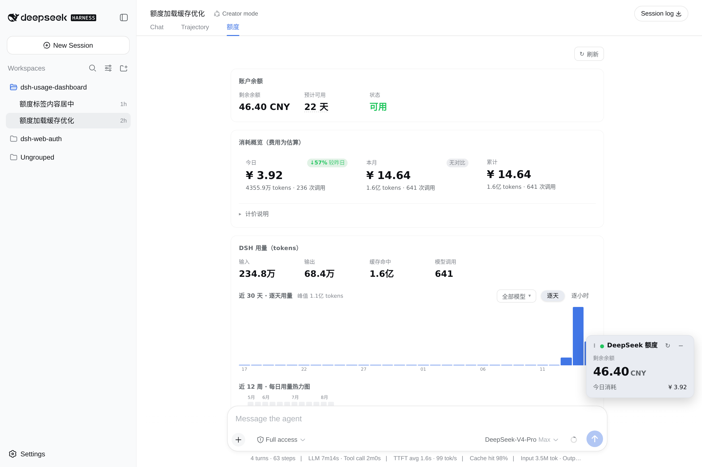

# dsh-usage-dashboard

一个给 [DeepSeek Harness](https://github.com/deepseek-ai)（DSH）Web GUI 用的额度与用量仪表盘插件，以 **DSH 插件包（bundle）** 的形式安装。

它把 DeepSeek 账户余额和 DSH 里的 token 用量汇总到一起，做成两个界面：

- 右下角一个可拖动的**悬浮额度窗**（实时余额）。
- 顶部栏「对话 / 轨迹」旁的一个 **「额度」view tab**（完整仪表盘）。



## 功能

### 悬浮额度窗（右下角）

- 显示当前账户余额（总余额 / 赠送额度 / 充值额度）与**今日消耗**。
- 可拖动，松手自动吸附到主区域（不含侧边栏、右侧详情面板与会话顶栏）四个角落。
- 可收起/展开，60 秒自动刷新余额。
- 显示/隐藏、所在角落、收起状态都会记住，刷新页面后保持原样。
- 余额低于预警线时，状态点与余额数字转为警示色。
- 悬浮窗自身不会触发用量聚合（那是秒级操作）；今日消耗读共享缓存，点 ↻ 才重新拉取。

### 「额度」仪表盘 tab

- **账户余额**：剩余余额（hover 看赠送/充值拆分）、**预计可用天数**（按近 7 天日均消耗折算）、可用状态。
- **消耗概览**：今日 / 本月 / 累计三个窗口的费用、tokens 与调用次数，今日带「较昨日」、本月带「较上月同期」环比；
  可展开**计价说明**，列出费用估算实际用的单价表。
- **DSH 用量**：输入 / 输出 / 缓存命中 / 调用次数；近 30 天逐天与 0–23 点逐小时柱状图（可按模型多选过滤）；近 12 周热力图。
- **高峰 / 闲时分布**：用量落在峰谷两侧的占比；2026-08-17 新价生效前显示「同样用量在新价下要多少钱」，生效后显示「挪到闲时能省多少」。
- **缓存命中与节省**：前缀缓存命中率、已节省费用、若全部未命中的对照价。
- **模型成本排行**：按费用降序，含占比条与输入/输出/缓存拆分；模型配色与图表图例一致。
- **设置**：悬浮窗开关、余额预警线（填 0 关闭）。

图表交互：柱状图与热力图 hover 即时显示 tooltip（日期 / tokens / 费用 / 调用次数）；
加载中显示骨架屏而非空态文案；刷新失败保留缓存数据并说明是哪一半失败。

## 安装 / 使用

这是标准 DSH 插件包（bundle + client 双面包），通过 `dsh plugin` 安装：

```sh
# 本地 checkout 安装
dsh plugin --profile web add ./path/to/dsh-usage-dashboard

# 或从 GitHub 安装（git 依赖会执行 prepare 脚本构建）
dsh plugin --profile web add github:Cassius0924/dsh-usage-dashboard
```

然后**重启 dsh**（`dsh --profile web`）生效。

- 前提：已配置 `DEEPSEEK_API_KEY`（在「设置 → 模型」里填写，或放在 `$DSH_HOME/.credentials.yaml`）。
- 前提：本机需要 pnpm（`dsh plugin` 是 pnpm 的转发器）。

## 开发 / 构建

```sh
pnpm install    # 安装 devDependencies
pnpm run build  # esbuild 构建 lib/index.js（host）+ lib/client.js（client bundle），再 tsc 出类型
pnpm run typecheck
```

产物：

- `lib/index.js` —— Host 半（ESM，Node），注册 `/api/dsh-usage-dashboard/*` 路由。
- `lib/client.js` —— Client 半（CJS 闭包），通过 `window.__ModuleLoader__` 注册进 web 启动图。

## 文件结构

```
dsh-usage-dashboard/
├── package.json         # dsh.bundle + dsh.client 声明
├── cordis.patch.yml     # bundle 层（一行 insert）
├── build.mjs            # esbuild 构建脚本
├── tsconfig.json
├── src/
│   ├── index.ts         # Host 半入口（webServer 路由）
│   ├── usage.ts         # 余额 + 用量聚合
│   ├── trust-fence.ts   # 浏览器信任校验
│   ├── wire.ts          # JSON 响应工具
│   ├── contract.ts      # wire 类型
│   └── client/
│       ├── index.tsx    # Client 半入口（slots 注册）
│       ├── widget.tsx   # 悬浮额度窗
│       ├── dashboard.tsx# 「额度」tab 仪表盘
│       ├── charts.tsx   # 柱状图 / 热力图
│       ├── styles.ts    # CSS
│       ├── api.ts       # fetch 客户端
│       └── store.ts     # 悬浮窗开关状态
└── lib/                 # 构建产物（git 忽略）
```

## 已知限制

- 用量数据来自本机 DSH 会话日志，不包含其它机器/账户的用量。
- 费用是**估算**：按 `src/pricing.ts` 里的价目表，逐条用量记录按「模型 + 是否落在高峰时段」计价
  （2026-08-17 00:00 起的峰谷定价：高峰为北京时间 09:00–12:00、14:00–18:00，闲时价格减半；
  该日之前的记录仍按旧的固定价）。未识别的模型按 deepseek-v4-pro 计价。
  仪表盘里的「计价说明」会展开当前实际使用的单价表。DeepSeek 再调价时只需改 `src/pricing.ts`。

## License

[MIT](./LICENSE)
